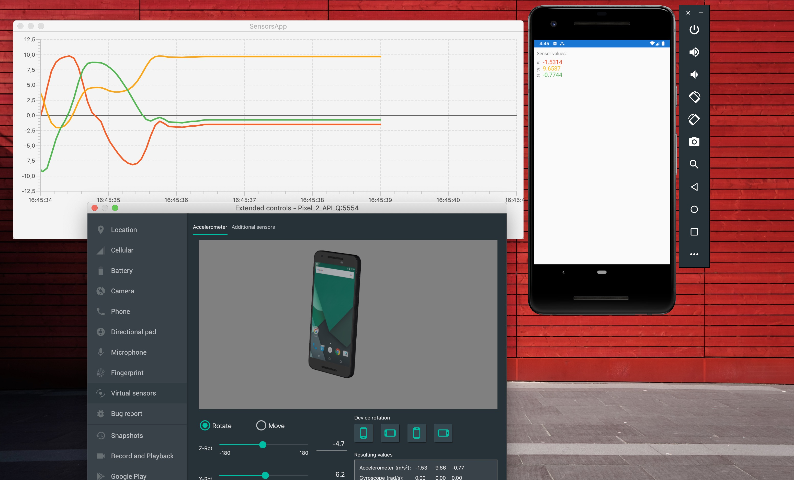

# Sensors.Edu

**Applications for Android and Desktop as an example for Mobile Systems Class for masters at Schmalkalden University of Applied Science.**

*[Link to presentation on GoogleSlides](https://docs.google.com/presentation/d/1Ygt7GDcUwLcNFIzwa9xeP_fxI7hb5iAJ7cdLqeheb-4/edit?usp=sharing "Google Slides")*

Created at Sat Jul 06 17:34:07 CEST 2019