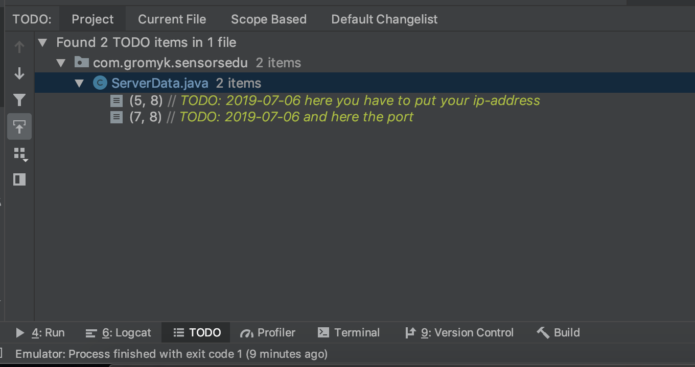

SensorsEdu

To configure server-address for the Android-Client you should go to file
**__Sensors.Edu/android/app/src/main/java/com/gromyk/sensorsedu/ServerData.java__**

and change IP_ADDRESS variable to desired string.
Also you can open TODO in Android Studio and find there two todos to change server address.

By default server and client work on the port 3000, to change it go to the same file and change there PORT variable to appropriate for you.